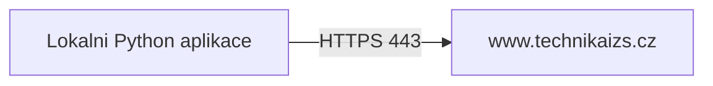

# Dokumentace projektu MLproject

## 1. Identifikace projektu

- Nazev projektu: MLproject - Crawler + YOLO anotace vozidel IZS
- Typ projektu: Skolni projekt
- Autor: Michal Nemec
- Kontakt autora (email): nemec6@spsejecna.cz
- Skola: SPSE Jecna
- Datum vypracovani teto dokumentace: 2026-03-30
- Verze dokumentace: 1.0

## 2. Ucel a rozsah

Projekt slouzi ke stahovani obrazku vozidel IZS z webu, jejich automaticke anotaci pomoci modelu YOLOv8 a exportu vysledku pro dalsi zpracovani nebo trenovani modelu.

Hlavni cile:
- automatizovat sbirku obrazkovych dat,
- automatizovat tvorbu anotaci,
- generovat vystupy ve standardnim formatu pro YOLO.

## 3. Pozadavky uzivatele/zadavatele (specifikace)

### 3.1 Business requirements

- BR-01: Uzivatel musi byt schopen stahnout obrazky z definovanych kategorii IZS.
- BR-02: Uzivatel musi byt schopen automaticky anotovat stazene obrazky AI modelem.
- BR-03: Uzivatel musi dostat export, ktery lze pouzit pro trenovani modelu.
- BR-04: Uzivatel musi mit moznost kontrolovat vystupy (JSON, YOLO labels, nahledy).

### 3.2 Functional requirements

- FR-01: Aplikace musi stahnout obrazky do struktury `stahnute_obrazky/<kategorie>/`.
- FR-02: Aplikace musi podporovat kategorie `hasici`, `policie`, `zachranka`.
- FR-03: Aplikace musi umet spustit inferenci YOLOv8 nad slozkou obrazku.
- FR-04: Aplikace musi umet ulozit anotace do `annotations.json`.
- FR-05: Aplikace musi umet ulozit YOLO labely (`.txt`) a `classes.txt`.
- FR-06: Aplikace musi umet volitelne generovat nahledy s bbox (`annotated/`).
- FR-07: Aplikace musi umet preskocit uz zpracovane soubory (`skip_existing`).

### 3.3 Non-functional requirements

- NFR-01: Python 3.10+ (doporuceno).
- NFR-02: Internetove pripojeni pro crawler.
- NFR-03: Dostupna diskova kapacita dle objemu stahovanych dat.
- NFR-04: Vykonny HW zkracuje dobu inferencniho behu (GPU volitelne).
- NFR-05: Stabilni beh zavisi na dostupnosti ciloveho webu a podminek pristupu.

## 4. Architektura aplikace

### 4.1 Komponenty a odpovednosti

- `lib/crawler.py`: web crawling, paginace, extrakce odkazu a stahovani obrazku.
- `run_crawler.py`: launcher crawleru + instalace zavislosti pri chybejicich modulech.
- `annotate_all.py`: batch anotace, mapovani trid, export JSON/YOLO, volitelna dataset struktura.
- `setup_yolo.py`: kontrola prostredi, zavislosti a adresaru.
- `master_control.py`: jednoduche CLI menu pro spousteni hlavnich skriptu.
- `view_annotations.py`: prohlizeni anotaci (legacy workflow).
- `app.py`: Streamlit demonstracni rozhrani pro detekci na nahranem obrazku.

## 5. Rozhrani, protokoly, zavislosti tretich stran

### 5.1 Externi rozhrani a protokoly

- HTTP/HTTPS GET pozadavky na cilovy web (`https://www.technikaizs.cz`).
- Souborove rozhrani local filesystem (cteni/zapis obrazku, txt, json).
- CLI vstupy pres terminal (`input()`) v `annotate_all.py`.

### 5.2 Knihovny tretich stran (requirements)

- `requests>=2.31.0`
- `beautifulsoup4>=4.12.0`
- `urllib3>=2.0.0`
- `ultralytics>=8.0.0`
- `opencv-python>=4.8.0`
- `numpy>=1.24.0`
- `Pillow>=10.0.0`
- `torch>=2.0.0`

### 5.3 Silne zavislosti

- Modelove vahy YOLO (`yolov8n.pt`, `yolov8m.pt`, pripadne `best.pt`).
- Dostupnost internetu pri crawlovani.
- Dostupnost Python runtime a pip balicku.

## 6. Pravne a licencni aspekty

- Projekt je veden jako skolni projekt.
- Je nutne respektovat podminky ciloveho webu pri stahovani obsahu.
- Je nutne respektovat autorska prava ke stazenym obrazkum. ©2021-2025 TECHNIKAIZS.CZ | REDAKCE@TECHNIKAIZS.CZ 

## 7. Konfigurace programu

### 7.1 Konfigurace crawleru

V `lib/crawler.py`:
- `BASE_URL`: cilova domena.
- `OUTPUT_DIR`: vystupni slozka pro stazene obrazky.
- `CATEGORIES`: mapovani kategorie -> URL.
- `max_images` v `crawl_category_unlimited(...)`: limit stazenych obrazku na kategorii.

### 7.2 Konfigurace anotace

V `annotate_all.py` (interaktivne):
- model (`yolov8n/s/m/l/x` nebo custom cesta),
- confidence threshold (0-1),
- combined output ano/ne,
- recursive scan ano/ne,
- skip existing ano/ne,
- save JSON/YOLO/annotated,
- create dataset structure (`images/ + labels/`).

Mapovani trid:
- `CLASS_MAPPINGS` urcuje mapovani modelovych trid na cilove tridy datasetu.

## 8. Instalace a spusteni

### 8.1 Instalace

```bash
pip install -r requirements.txt
```

### 8.2 Spusteni

```bash
python run_crawler.py
python annotate_all.py
```

Volitelne:

```bash
python setup_yolo.py
python master_control.py
python app.py
```

## 9. Chybove stavy, kody a reseni

Projekt nepouziva centralni system ciselnych kodu chyb; chyby jsou reportovany textove do konzole/logu.

Typicke chyby a reseni:

- Chyba importu modulu (`ImportError`):
  - Reseni: `pip install -r requirements.txt`.

- Model nelze nacist (`Failed to load model` v `annotate_all.py`):
  - Reseni: overit existenci `.pt` souboru a kompatibilitu `ultralytics/torch`.

- Nenalezeny vstupni slozky (`Folder not found`):
  - Reseni: spustit crawler nebo opravit cesty.

- Nenalezeny obrazky (`No images found`):
  - Reseni: zkontrolovat obsah `stahnute_obrazky/*` a pripony souboru.

- Chyby site pri crawlovani (`RequestException`, timeout):
  - Reseni: opakovat beh, zkontrolovat pripojeni, pripadne snizit zatez.

- Chyba zapisu souboru (prava/disk):
  - Reseni: zkontrolovat opravneni slozek a volne misto na disku.

## 10. Overeni, testovani a validace

### 10.1 Strategie testovani

- Manualni funkcni testy pro crawler workflow.
- Manualni funkcni testy pro anotacni workflow.
- Kontrola vystupnich artefaktu (`annotations.json`, `labels/*.txt`, `classes.txt`, `annotated/*`).
- Zakladni staticka kontrola Python souboru (bez syntax chyb v hlavnich skriptech).

### 10.2 Provedene testy (souhrn)

Stav ke dni 2026-03-31:
- Kontrola aktualizovanych skriptu launcher/setup: bez nahlasenych syntax chyb.
- Kontrola dokumentacnich odkazu po presunu crawleru: reference sjednoceny na `lib/crawler.py`.

### 10.3 Vyhodnoceni splneni pozadavku

- BR-01 az BR-04: splneno na urovni funkcionality skriptu.
- Otevrene body: formalizace verzovani, centralni evidence bugu, doplneni autora/skoly/licence.

## 11. Verze a zname problemy

### 11.1 Verze

- Dokumentace: 1.0 (2026-03-31)
- Aplikace: rolling verze (neni formalne verzovana semver tagy)

### 11.2 Zname bugy/issues

- `master_control.py` a `view_annotations.py` obsahuji legacy predpoklady na starsi vystupni cesty.
- Crawler muze byt citlivy na zmeny struktury ciloveho webu.
- Neni centralni logika pro standardizovane chybove kody.

## 12. Databaze, sit, sluzby, HW/SW

### 12.1 Databaze

- Databaze se nepouziva.
- E-R model: N/A.

### 12.2 Sit

- Pouzita sit: odchozi HTTPS provoz klient -> cilovy web.
- Priklad schematu:



- Rozsahy site a specialni routovani nejsou vyzadovany pro bezny desktop beh.

### 12.3 Dalsi sluzby/HW/SW

- Python runtime a knihovny z `requirements.txt` jsou nezbytne.
- Ultralytics YOLO + Torch jsou kriticke pro inferenci.
- GPU neni povinne, ale muze vyznamne zrychlit beh.

## 13. Import/Export specifikace

### 13.1 Vstupy

- Obrazky: `.jpg`, `.jpeg`, `.png`, `.bmp`, `.gif`, `.tiff`, `.webp`.

### 13.2 Export JSON (`annotations.json`)

Priklad struktury jedne polozky:

```json
{
  "image": "stahnute_obrazky/policie/example.jpg",
  "detections": [
    {
      "class_id": 2,
      "class_name": "car",
      "class_name_mapped": "policie",
      "confidence": 0.87,
      "bbox": {
        "x_min": 120.4,
        "y_min": 88.1,
        "x_max": 380.6,
        "y_max": 270.2
      }
    }
  ],
  "num_detections": 1,
  "error": null
}
```

Povinne polozky:
- `image`
- `detections`
- `error`

## 14. Odkazy na hlavni soubory projektu

- `README.md`
- `run_crawler.py`
- `lib/crawler.py`
- `annotate_all.py`
- `setup_yolo.py`
- `master_control.py`
- `requirements.txt`
- `app.py`